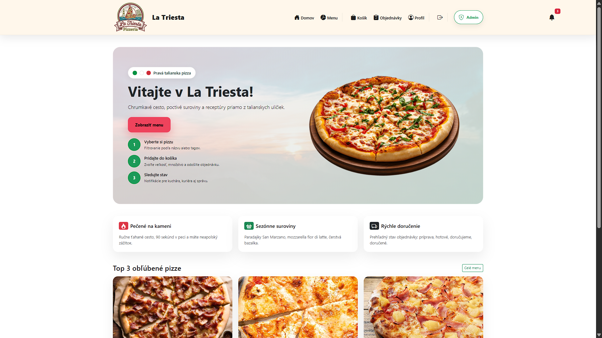

# La Triesta

La Triesta is a platform for managing pizza orders and delivery. It allows customers to browse the menu, place orders, and track them, while providing tools for administrators, chefs, and couriers to manage and fulfill orders efficiently.
## Features
- User authentication and role-based access control.
- Dynamic menu filtering by tags and search input.
- Order management for users and administrators.
- Responsive design for a seamless user experience.

## Technologies Used
- **Backend**: Java, Spring Boot, Spring Security, Hibernate.
- **Frontend**: Thymeleaf, HTML, CSS, JavaScript.
- **Database**: SQL (MySQL).
- **Build Tool**: Maven.

## Screenshots

### Home Page


### Pizza Page


### Admin Page


### Chef Page


## Getting Started

### Prerequisites
- Java 17+
- Maven
- A relational database (e.g., MySQL)

### Installation
1. Clone the repository:
   ```bash
   git clone https://github.com/your-username/latriesta.git
   
### Default Credentials
- admin@email.com | 11111111
- user@email.com | 11111111
- chef@email.com | 11111111
- courier@email.com | 11111111